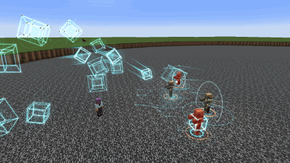
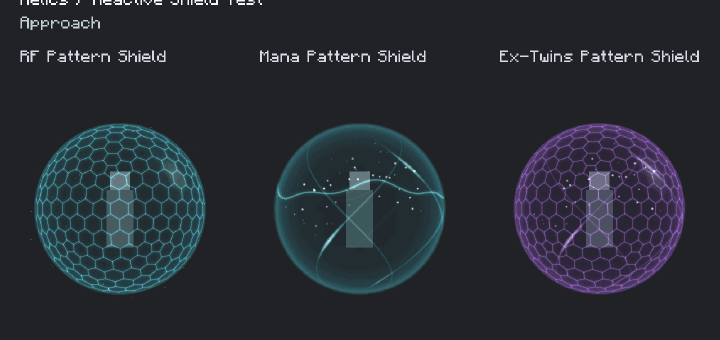
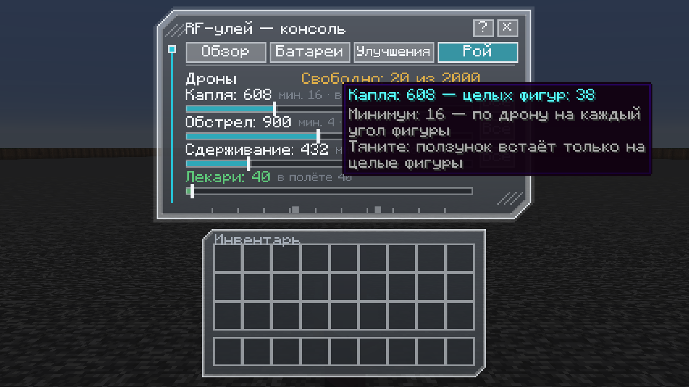
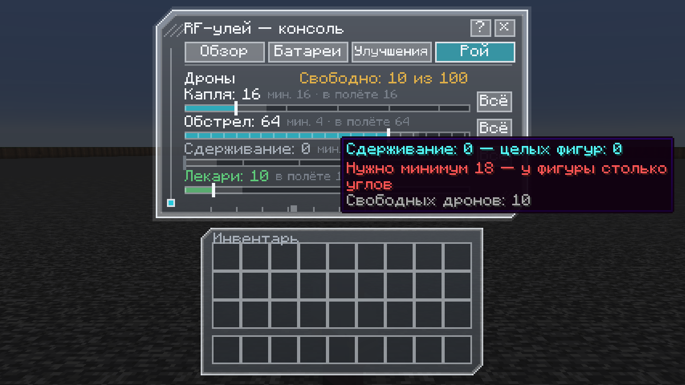
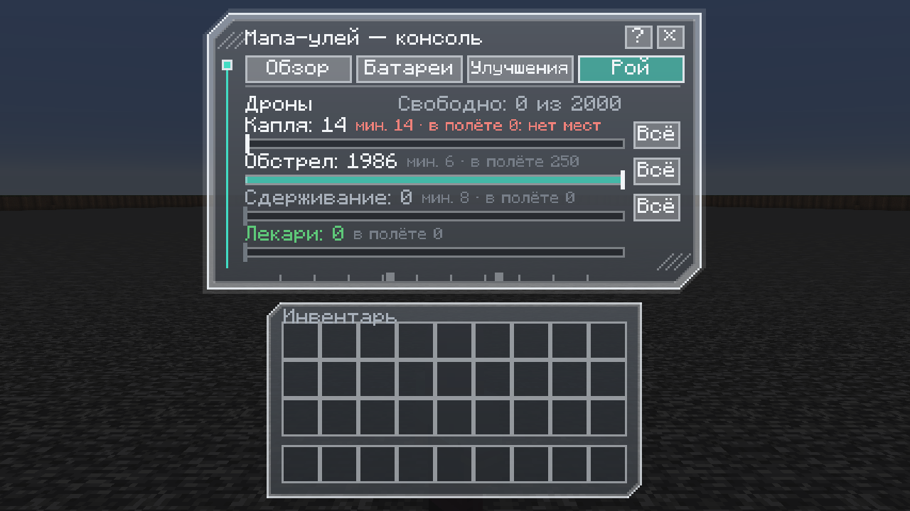

# EX-twins

Expandable autonomous shields and combat hives for Minecraft 1.21.1, NeoForge and Curios. Progression and upgrades are built into this mod; Relics is not required. Effects use [Photon](https://github.com/Low-Drag-MC/Photon).





The showcase above is rendered in-game by the capture galleries: shield impacts on the honeycomb, then a 750-drone hive deploying 250 drones in each attack mode. The droplet figures fly from the fan behind their owner (the coloured outline) to the target (the grey outline). It is not a live-world battle recording, and the GIF has no audio. The older [46.5-second showcase](https://github.com/discardbomb-cyber/EX-twins/releases/download/v1.0.0-beta.1/EX-twins-showcase.gif) is still attached to the 1.0.0-beta.1 release.

## Installation

Install `EX-twins-1.0.0-beta.1.jar` on both the client and server alongside Curios, Photon, LDLib2 and KilaGraph (Photon 2.2.7+, LDLib2 2.2.40+). This is a beta release; back up existing worlds before upgrading. Devices run on built-in batteries; Botania, Ars Nouveau and Iron's Spells are optional mana sources.

Optional, client only: with [LambDynamicLights](https://modrinth.com/mod/lambdynamiclights) 4.8.11+ installed, the mod's effects light up the world around them: a visible shield (brighter for a moment after each hit), swarm strike groups, barrage charges while they build and in flight, blasts, the containment constructs, the Twins black hole, and the Armageddons (the Mana flowers, streams, sphere, seal and column among them). Nearby lights are merged and capped at 24 sources so chunk relighting stays cheap; the light is colourless. Client config `lights.dynamic` turns it off. Without LambDynamicLights nothing changes.

## Build From Source

Use Java 21 and the included Gradle wrapper. Curios, Photon, LDLib2 and KilaGraph are resolved from their Maven repositories (`maven.theillusivec4.top`, `maven.firstdark.dev/snapshots`); nothing has to be placed in `libs/`. LambDynamicLights (`maven.gegy.dev`) is only compiled against; the development clients load it, while `runGameTestServer` and `runReleaseCheckClient` run without it.

Run `./gradlew build` on Linux/macOS or `.\gradlew.bat build` on Windows. The result is `build/libs/EX-twins-1.0.0-beta.1.jar`. The first build requires internet access for Gradle and NeoForge artifacts.

## Items

- `relics_addon:rf_shield` -> Curios `charm`
- `relics_addon:mana_shield` -> Curios `charm`
- `relics_addon:twins_shield` -> Curios `charm`
- `relics_addon:rf_hive` -> Curios `charm`
- `relics_addon:mana_hive` -> Curios `charm`
- `relics_addon:twins_hive` -> Curios `charm`
The RF, Mana, and Ex-Twins labels are style identities. Shields operate without external energy.
Standalone drone item IDs are no longer registered. Hives deploy their existing models as typed defensive swarms; old `rf_drone`, `mana_drone`, and `twins_drone` stacks are unsupported and will not be converted.

## Playable Build

Version `1.0.0-beta.1` targets Minecraft 1.21.1, Java 21 and NeoForge 21.1.212.
The three shields and three hives use the charm (Amulet) slot. Slot count remains controlled by the modpack. Each has a recipe and recipe-book unlock.
Press `H` (rebindable in Controls) or hold Shift over a device to open its console: a holographic window with Overview (power switch, level, integrity, charge and the device's main stats), Batteries, Upgrades and, on hives, Swarm tabs. Labels shrink to fit their buttons; anything still cut short shows in full when hovered. Using a held device also toggles it.
Each of the six items stores its own experience, levels, upgrade points and upgrade ranks in its item data. Combat awards bounded experience; each new level grants one upgrade point.

- Shields have a shared 504 HP buffer, upgraded to 5000 HP over ten protection levels, plus 420 independent cells with 12 HP each. Incoming damage spends the buffer first, then local HP; empty regions become real holes when the buffer is exhausted. Total maximum at full progression: 10040 HP. Upgrading, toggling and changing settings do not refill HP.
- The shell hits back: an aggressive mob touching it is thrown clear and takes the shield's own damage, 3-7 RF discharge (softened by armour), 2.5-6 Mana burst or 4-9 Twins surge (both through armour) from level 0 to 10. One mob is struck at most once a second; each strike costs 6 battery points. Neutral mobs such as endermen and zombified piglins are only struck once they attack the wearer. Server config: `shield.strikeDamage`, `shield.strikeKnockback`, `shield.strikeCooldownTicks`.
- RF and Twins shells are a honeycomb of the 420 gameplay cells: flat glass panes joined by bright seams, with a sheen that follows the light; damaged RF cells warm through yellow to red, Twins cells dim, and a broken cell is a hole. Mana is one seamless teal dome. A shield is invisible until it is struck (client config `shield.idleOpacity` can keep it faintly visible).
- After 40 quiet ticks, type-specific repair restores damaged cells before refilling the shared buffer. New topology and neighbors are cached once, not rebuilt during combat.
- Shield radius starts at 2 blocks and unlocks up to 12 with protection upgrades. Choose the actual radius with `/relics_addon shield_radius <radius>`. Server config can impose a lower ceiling. RF plates have deterministic radial relief. Mana forms a smooth turquoise glass hemisphere facing the incoming projectile, with a luminous rim and traveling waves. Twins combines a continuous violet-black membrane, raised honeycomb segments and suspended violet motes. Hits on the Mana and Twins shields send a travelling wave across the shell: the surface bends into a crest and trough, and a refraction band on the wave front distorts the world behind it (client config `shield.refraction`, disabled automatically under Iris/Oculus shader packs).
- Every impact brightens its region and launches an expanding wave across the visible field. Up to twelve recent impacts are retained, including hits during the same server tick; later waves do not reset earlier animation. Mana hemispheres clip to the incoming side and merge without double opacity. Idle fields remain invisible. Supported hostile projectiles born inside the shield are intercepted immediately beside the projectile; friendly shots are excluded.
- `/relics_addon shield_coverage owner|allies|all` controls protection of creatures inside the sphere. The default is the owner, teams and tamed allies; `all` explicitly includes other living creatures. Melee and explosion protection use the covering owner's HP and incoming direction. These commands require no operator privilege and never change another player's item.
- Unknown mod bullets require the `relics_addon:shield_interceptable_projectiles` entity-type tag or the `shield.interceptedProjectiles` server config list; hitscan weapons need an adapter. Unless listed there, tridents and utility pearls/potions are not removed.
- Server config lists tune what the field stops. All are empty by default; entries are registry ids or `#tags`, read once per config load or reload, and a malformed or unknown entry is logged as a warning and matches nothing.
  - `shield.passingDamageTypes`: damage types that always reach the wearer, on top of the `relics_addon:shield_passes` damage-type tag (starvation, drowning, suffocation, the void and similar), e.g. `["minecraft:fall", "#minecraft:is_fire"]`.
  - `shield.absorbedDamageTypes`: damage types the field absorbs although `shield_passes` lets them through, e.g. `["minecraft:drown"]`. `shield.passingDamageTypes` wins over it, and shield strikes and swarm blows always pass.
  - `shield.interceptedProjectiles`: entity types the field stops in flight besides arrows and the tag above, e.g. `["minecraft:snowball"]`. Tridents, pearls and potions listed here are stopped too.
  - `shield.ignoredProjectiles`: entity types the field never stops in flight, overriding every other rule. Their hits are still absorbed at the wearer unless their damage type passes the field.
  - `shield.keptEffects`: harmful effects the field never cuts off or trims when an attacker applies them, e.g. `["minecraft:poison"]`.
- Eligible damage first spends common buffer HP, then the struck cell and the configured neighbor share. There is no baseline percentage leak. Any excess after this protection is exhausted reaches the wearer immediately; later hits through that hole pass until repair or gathering. Other intact cells continue protecting.
- Explosion protection spends the common buffer first and then local HP on the explosion side. Terrain destruction and knockback remain vanilla behavior.
- Upgrades are bought in the console's Upgrades tab with points earned from levels (one point per rank, three ranks each). Each shield and hive uses its own illustrated 22x31 upgrade cards; inventory item views remain 3D.
- Distribution: RF 25-45% from relic level 2, Mana 20-35% from level 3, Ex-Twins 35-50% from level 2. Each has three upgrade levels and uses the same two-neighbor HP-conserving mechanic.
- Gathering: RF 1-2 cells from level 4; Mana 1-3 from level 2; no Ex-Twins gathering. Travel remains 10 ticks with a 40-tick cooldown. Moving cells cannot protect until arrival, retain HP and leave donor holes.
- Restoration unlocks at relic levels 5/4/3 for RF/Mana/Twins and upgrades passive recovery to 2/3/2 HP per repair step. Twins additionally unlocks barrier stabilization at level 4, reducing the post-hit recovery pause from 40 to 16 ticks. Neither upgrade raises the 5000 HP buffer limit or refills protection on purchase.
- Ex-Twins retains subtle arcane seals beneath its raised segments. On a confirmed absorption, violet circuit-board traces grow out from the hit point across the shell, forking and ending in pads, with a signal pulse running along them. Every shield also gets an additive glow that flares at hits and along the wave crest.
- The hit-time damage fallback respects vanilla shield-bypass tags. Fake players, spectators and disabled slots do not operate the relics.
- The main shield ability keeps fixed full absorption while upgrading buffer capacity and radius. Distribution/gathering remain separate upgrades. Successful combat and absorption award bounded experience; idle time and repair do not.
- Shield inventory and world views reuse the same animated 3D models.

## Crafting

Devices are built from the mod's own parts rather than raw vanilla items (all use vanilla materials, so any pack can craft them):

| Part | Made from | Goes into |
| --- | --- | --- |
| Resonant Circuit (x2) | gold nuggets, redstone, quartz, copper ingot | every part and device |
| Energy Cell | copper, iron, redstone block, circuit | RF and Twins devices (RF battery) |
| Mana Cell | amethyst shards, gold, lapis block, circuit | Mana and Twins devices (mana battery) |
| RF / Mana / Twins Shield Core | a vanilla shield, iron and diamond / gold, amethyst block and diamond / crying obsidian, echo shards and diamond, plus circuits | the matching shield |
| RF Drone Frame (x2) | iron, copper, redstone, circuit | RF Hive (six frames) |
| Mana Drone Shell (x2) | gold nuggets, amethyst shards, circuit | Mana Hive (six shells) |
| Twins Drone Plate (x2) | obsidian, amethyst shards, circuit | Twins Hive (four plates, both cells and an end crystal) |

Recipes unlock in the recipe book once you hold the key part. Icons are drawn by `tools/draw_component_icons.mjs`.

## Batteries

Every device has built-in batteries: RF shields and hives an RF battery, Mana devices a mana battery, and Twins devices both. A switched-on device only works while one of its switched-on batteries holds charge; the console monitor shows NO POWER otherwise. New devices ship fully charged, and capacity grows with the device level (25 000 to 100 000 points; one point is 10 FE).

- Upkeep: 20 points per second for a running shield, 20 plus one per ten drones for a hive. Absorbing damage costs 10 points per HP, shield repair 2 per HP, each drone shot 3, healing 5 per HP and drone repair 1 per HP. Twins split every cost between their two batteries and fall back to whichever still has charge. Creative players pay nothing.
- The RF battery is a Forge Energy item: any FE charger (Mekanism, Thermal, Flux Networks and similar) can fill it, and a charged FE item placed in the console's charge slot pours its energy in. Machines cannot drain it.
- The mana battery refills twice a second while the device is on. Its source is chosen in the console: Auto (magic mods first, then experience), Magic (Botania mana items such as tablets and rings, the player's own Ars Nouveau or Iron's Spells mana) or Experience. Player mana keeps a 25% reserve for spellcasting. All rates are server config (`power.*`), and `power.requireBatteries = false` makes devices free.
- Each battery has its own on/off switch in the console's Batteries tab.

Hover a device in any inventory screen (including the Curios screen) and hold Shift to open its console; any click cancels the hold, so shift-clicking still moves the item.

Photon (with LDLib2 and KilaGraph) is required for particle effects.

## Combat Hives

Each type has its own 22x31 upgrade cards and animated 3D hive amulet. Equip it in a charm slot and switch it on. Only one hive can be worn at a time. The deployed defenders reuse the existing RF/Mana/Ex-Twins drone models.

RF hives have four silver mechanical bay doors, Mana has six ivory/gold shells, and Ex-Twins has twelve black pentagonal plates with violet circuit inlays. Inventory icons render these same animated OBJ models. Generator: `tools/build_hive_meshes.py`.

| Type | Drones: level 0 -> 10 | Flying at once | HP per drone | Repair delay -> upgraded | Blow damage -> upgraded |
| --- | --- | --- | --- | --- | --- |
| RF | 100 -> 2000 | up to 250 | 3 | 4 -> 2 seconds | 2 -> 3 |
| Mana | 100 -> 2000 | up to 250 | 3 | 2.5 -> 1 second | 2 -> 3 |
| Ex-Twins | 100 -> 2000 | up to 250 | 3 | 6 -> 3 seconds | 3 -> 4 |

Ten levels grow the swarm from 100 to 2000 drones. At most 250 fly at once; the rest wait in the hive as replacements. Only one hive can be equipped (Curios rejects a second one), and only one operates.

- Share the drones between three attack modes in the console's Swarm tab (see [Sharing the drones](#sharing-the-drones)). The modes fight at once, each with its own drones:
  - **Droplet.** Its drones form figures, as many whole ones as they make (one to sixteen), in a fan behind and above its owner. The drones are the figures' corners, and the lines between them run from drone to drone. In turn, each figure strikes its target whole and knocks it back:
    - RF, a tesseract ram: the tesseract turns through the fourth dimension, closes into a solid cube as it winds up, rams into the target with a clang of metal, then flies apart in a fan of its drones and gathers again on the way home.
    - Mana, a rain of drops: each figure is a faceted glass drop that climbs high over the target and falls on it from above, one after another, splashing into glass spray and rings spreading over the ground like ripples on water.
    - Ex-Twins, a rift jump: each figure of hexagons, with lightning leaping between them, dives into a tear in space behind its owner and bursts out of another by the target, and goes home the same way.
  - **Barrage.** Its drones pack into glowing clumps of about sixteen around the target, and each target's clumps draw the family's pattern: an RF crown, a Mana star, Ex-Twins octagons. A shot charges in each clump. When it fires, it passes through walls and bursts on the target, warping the space around it. Now and then a few drones hop to a neighbouring clump, and lightning leaps between clumps.
    - RF clumps are small crowns of drones tumbling over every axis. Their shot is a ring of lightning a quarter of a block across: a spark, then a bright ring round a dark middle, then a ring in branching bolts. It trails small bolts and bursts in discharges every way.
    - Mana clumps charge glowing balls, as before.
    - Ex-Twins clumps are octagons that crackle with lightning and shed violet smoke. Their shot is a violet glass icosahedron that turns faster in flight and shatters into shards of glass.
  - **Containment.** Each construct holds one creature, so a mode with drones for several constructs holds several. Every family stuns what it holds:
    - RF shuts the target in a Faraday cage: a geodesic sphere whose drones are its joints and whose conductors carry blue and orange currents, closing from the ground up like petals. It zaps its prisoner, and the shots the prisoner fires strike the cage and run off it into the ground as lightning.
    - Mana closes a lotus over the target: tiers of glass petals rising from the ground into a bud. Drones keep a reflection buffer charged (golden motes run up the petals' edges), and a blow into the lotus flies back at the attacker as golden sparks.
    - Ex-Twins cracks space round the target: hexagonal shards of it circle on their own axes, with the void and its stars behind them and circuit traces along their edges, and the target hangs in the crack, lifted into the air. The world round the rift bends and darkens.
    - A construct locks shut with a flash and a sound, and bursts into its drones with sparks when it lets go. A heads-up circle turns on the ground under what it holds.
    - Every construct is sized from the creature it holds: its inside clears the hitbox by a fifth of its size on every side.
    - Players and bosses cannot be held.
- Every blow has its wind-up, its flight and its landing, and something lingers for a moment after: a heads-up aim circle closes on the ground under the target before the blow, drones in flight leave thin trails, and a blow lands as a white-hot core, a shock ring through the air and over the ground, a spray of many small sparks (RF throws falling drops of metal), and a scorched ring, ripples or smoke and cracks. Blows within 16 blocks nudge the camera. All of it is geometry in the world. The client config's `hive.effects` (`low`, `normal`, `high`) sets how much is drawn and `hive.shake` how hard the camera is nudged.
- Every attack sounds in layers, synthesized for this mod: a wind-up, the rush of a figure in flight (following it, rising and falling as it passes), a blow with a low end in a few variants, and what rings on after. Each strike group's blow is its own step of a pentatonic scale, so a swarm's blows play an arpeggio. Constructs lock shut with a sound of their own and hum while they hold. Listeners far off hear only a dull boom.
- Swarm blows land as the swarm's own damage type, which may knock the target back. Containment zaps never knock it about.
- The hive fights within 128 blocks of its owner by default. It takes on every creature that attacks its owner at once: whoever the owner fights, whoever strikes the owner or their shield, and every mob that has the owner as its target, up to 16. Containment holds the first ones, one per construct. Droplet and Barrage take on the rest first and then the held ones, one figure or pattern each at least, so the modes may strike the same creature. A target stays engaged until it dies, leaves that range, becomes allied or changes dimension, or the hive is switched off. When one falls, its drones fly straight on to the others from where they are instead of going home first.
- Each drone has 3 HP. Targets in reach swing at nearby drones, and explosions damage them too. A hit drone flies home for repair, and the next drone in its lane launches at once to take its place. A repaired drone waits in reserve.
- Drones pour out of the hive along their own curved paths and stream back when a task ends. Healers ring their owner's chest.
- Open the console with `H` and select a hive. The Swarm tab shares its drones between the modes and the healers. Assignments persist on the item. Healers restore only their owner and never attack. Healing is capped at 4 HP/second by default, which the server can configure.
- Each hive has three upgrades: combat damage, healing strength, and repair/reconstruction. They never raise the 2000-drone cap or the healing limit.
- Drones do not absorb damage for their owner; protection is the shield's job. Hives only attack and heal.
- Drone hits use their own damage type: the owner gets the kill credit, but hundreds of hits never knock the target around.
- Drones cannot target or damage their wearer, teammates or allied pets. They have no attackable projectile entities of their own, so swarms never damage each other. Creative/spectator players and disallowed PvP targets are excluded.
- Swarms contain no server-side drone entities or pathfinding. The item stores a compact drone array, and the network sends about one byte per resting drone. Flight is deterministic and computed identically on server and client, so blows land exactly where the shapes are drawn. Distant drones render as glowing points, and the renderer culls by frustum and distance.
- Hives are not a substitute for the shield's melee/explosion protection. Every family has original synthesized attack/impact and summon/dismiss sounds, shields have absorption, cell-break, collapse and ripple sounds, and the console has its own feedback sounds (`tools/build_combat_sounds.mjs`). Playback is spatially rate-limited to avoid hundreds of simultaneous voices.

### Sharing the drones

The Swarm tab has a row for each mode and one for the healers. A row shows how many drones it has, its minimum, how many of them fly, and a slider. The free drones, given to no one, are counted at the top. For example, 64 drones in Droplet, 120 in Barrage and 72 in Containment fight at once.



- **Minimum.** Drones stand on the corners of their mode's figure, so a mode has either no drones (it is off) or at least one per corner of one figure:

  | Family | Droplet | Barrage | Containment |
  | --- | --- | --- | --- |
  | RF | 16: a tesseract's corners | 4: a crown (every other point raised) | 12: the Faraday cage's icosahedron |
  | Mana | 14: a drop's tip, two rings of 6 and its back | 6: a star | 19: a lotus's base and six petals of three corners |
  | Ex-Twins | 18: three hexagons | 8: an octagon | 24: four hexagonal shards of the rift |

  Drones beyond the corners stand on finer points of the figures: the middles of the tesseract's faces, cells and edges, the drop's skin, smaller hexagons inside the Twins ones, finer geodesic spheres of the cage, more tiers of lotus petals, more rift shards.
- **Sliders.** Drag a mode's slider to give it drones or take them back to the free ones. It stops only on whole figures: 0, 16, 32, 48… for the RF tesseract, 0, 8, 16… for the Mana ward, with a tick at each. The lighter part of the track is as far as the free drones reach. A mode whose figure the free drones cannot build is greyed out, and hovering it says why ("Needs at least 18 drones: its figure has 18 corners"). The healers' slider moves one drone at a time, to and from the free drones. **All** puts every fighter into that mode and switches the others off, as a hive fought before the modes could be mixed. The server checks the same rules and refuses anything else, whatever the client sends.

  
- **In the air.** At most 250 drones fly. Healers take their places first; the modes share the rest in proportion to their drones. A mode whose share is smaller than its minimum does not fly at all, and its places go to the others. Its row shows this ahead of time: "flying 0: no room".

  
- **Losses.** A hit drone flies home and the next one in its lane takes its place; a lane that has run dry takes a spare drone of its mode. When a mode has no spare left and fewer drones in the air than one figure, it goes home instead of hanging as a broken figure. Once repairs give it enough again, it flies back into the fight by itself.
- **Smaller hive.** If a hive holds fewer drones than it has given out (after loading or a change of level), healers keep theirs first, then Droplet, Barrage and Containment in turn. A mode left short of its minimum is switched off and its drones are freed. The last line of the Swarm tab says which mode and why, and the server log says so too.
- **Old saves.** A hive saved when every fighter used one mode puts them all in that mode. If they are too few for its figure, they go to Barrage, and if they are too few even for that, they stay free. The Swarm tab says so.

### Armageddon

Armageddon is the ultimate of a level 10 Ex-Twins hive (a level 10 Mana hive has its own, [Mana Armageddon](#mana-armageddon), and so does a level 10 RF hive, [RF Armageddon](#rf-armageddon)). When both of the hive's batteries are full (98% or more), press `G` (rebindable) to open the confirmation window. It aims at the point you look at, up to 256 blocks away. The window shows the distance, the blast radius, the charge time and what a worn Ex-Twins shield will add.

- **Charge.** The whole swarm flies up into a cannon over its owner's head:
  - a core;
  - a two-layer barrel of hexagons;
  - four double rings that light one after another;
  - a gyroscope of six hoops.

  The charge takes a minute and drains the hive's battery. A worn Ex-Twins shield feeds it too, but never gives up the charge its own field needs.
- **Shot.** In the last seconds the hoops re-form into a flared funnel of hexagons. The cannon fires a ball of white light, held closed by three violet tori of drones. It reaches the target a second later.
- **Black hole.** As the ball touches its target it opens into a black hole 15 blocks across that bends the world round it hard. The tori break away and their drones fly off. The black hole then collapses into the point it touched over three seconds, beating like a pulsar. Meanwhile it tears up every block within 90 blocks and drags creatures in.
- **Supernova.** Then it bursts in stages:
  - a white flash fills the air, and everything nearby stands dark red against it while rocks fly;
  - a ball of light forms and sweeps out over the land to 256 blocks as a wave of glowing haze, bending the world at its front;
  - the ball is crushed back in;
  - a beam of energy erupts to the zenith and widens to 128 blocks across, boring the land out as it does;
  - inside the beam, black smoke writhes and balls of it rise at each deep pop;
  - the beam narrows to a thread and goes out in an orange dusk.

  The ball of light strikes each creature as it sweeps over it. Damage is 2000 at the heart and falls to 20 at the edge. All of it is drawn in the world, not laid over the screen, and it plays in time with its sound, about 30 seconds.
- **Targets.** It strikes mobs, and players who are not allied with the owner if the server allows PvP. It never strikes the owner, their teammates or their pets. The owner gets the kill credit.
- **Aftermath.** The escort drones come home once the smoke settles. The hive keeps only the charge the shield gave it.
- **Safe mode.** Servers can turn on `armageddon.safeMode` in the server config. The black hole and the blast still strike creatures, but no blocks are broken.

### Mana Armageddon

Mana Armageddon is the ultimate of a level 10 Mana hive. When its battery is full (98% or more), press `G` to open the confirmation window. It aims at the point you look at, up to 256 blocks away. The window shows the distance, what the vortex and the blast will reach, the charge time, how long the blast lasts and what a worn Mana shield will add.

- **Charge.** The swarm spirals into two flowers over its owner's shoulders, about 3 blocks to either side of the view with an empty gap between them. The turquoise flower is on the left and the gold one on the right, and both face the target.
  - Each flower has four rounded petals in an X. They fill from the heart out with drones and twinkling sparks, round a heart that swells with the charge.
  - Behind each flower is a seal: a double ring round a belt of runes, a seven-pointed star, and a ring at the core.
  - Round each flower, a gyroscope of three rune rings leans its own way.
  - Between the flowers, over the owner's head, hangs the central seal. Its left half is turquoise and its right half gold, with a rhombus in the middle, small rhombi down the seam, a sun and a crescent moon.

  The runes are written one by one, clockwise, with a spark at the pen, one ring after another. The last ring fills as the charge does, and each ring starts to turn once it is full. The charge takes a minute and drains the hive's battery. A worn Mana shield feeds it too (a Twins shield does not), but never gives up the charge its own field needs. The runes are our own script, drawn by `tools/draw_rune_atlas.mjs`.
- **Streams.** Each flower looses a stream, escorted by a ribbon of drones spiralling round it. The turquoise stream is dense and writhing, with scales at its edge; the gold one is a dazzling beam glinting in every colour. They arc out to either side and meet head-on at the target. Sparks and flakes fly, the ground shakes, and the land within 90 blocks is torn up into a vortex of swirling stones.
- **Sphere.** The flowers close. A small sun ignites where the streams met, inside a translucent sphere of runes that stands on a seal of blue rings. The seal lies on the ground itself, following slopes, steps and the crater under it.
  - The sphere's runes are written in a running wave. A wide band of runes turns round its equator against a thin band at an angle, and a glowing seam runs down its middle.
  - The fog inside it glows turquoise and gold round the sun.
  - The sun grows and presses from inside. The runes whiten, light cracks through them, and the sphere shatters into rune shards.
- **Blast.** The blast unfolds in stages:
  - a thin flash cuts across the land;
  - a ring of stones and burning runes runs out along the ground round a dark core;
  - a dome of light sweeps out over the land to 256 blocks;
  - a column of light rises from the seal and grows for as long as the blast is heard (on each client from the moment it begins to hear it), about 40 seconds, with runes rising up its wall and haze swirling up inside it;
  - at its widest (96 blocks across) the column dissolves into white light. A pale crescent moon hangs in the white sky, and turquoise and gold sparks fall in the silence. Then the drones come home.

  The dome of light strikes each creature as it sweeps over it, as the Twins blast does: 2000 at the heart, falling to 20 at the edge. The column is light only. All of it is drawn in the world, not laid over the screen. With a shader pack (Iris or Oculus) in use, simpler stand-ins are drawn instead.

  The blast's length is one number, `ManaArmageddon.BLAST_SECONDS`. The sound generator reads it, the column grows by it, and `verifyArmageddonSounds` checks that the charge, collision, sphere and blast sounds last exactly as long as the stages they score.
- **Targets, aftermath and safe mode** work as for the Twins Armageddon. The blast never strikes the owner, their teammates or their pets, and the owner gets the kill credit. The hive keeps only the charge the shield gave it. With `armageddon.safeMode`, the vortex tears up no blocks.

### RF Armageddon

RF Armageddon is the ultimate of a level 10 RF hive. When its RF battery is full (98% or more), press `G` to open the confirmation window. It aims at the point you look at, up to 256 blocks away. The window shows how far off the ball will strike, the crater it leaves, the blast radius, the charge time, how long the blast lasts and what a worn RF shield will add.

- **Charge.** The swarm flies in to the axis over its owner's head and builds a hologram of the relay drone, 13 blocks long, with its nose towards the target. The body goes up from the stern to the nose. Its drones sit on the frame's points and lines, joined by blue lines of light, with a scanline sweeping along them and a flicker running through.
  - The body is a cylinder with three copper belts, a cap behind and a cone in front.
  - Bundles of needle antennas stick out at the nose and the stern. The stern's are tipped with blinking redstone beacons.
  - Four long panels lie folded along the body. Each is a frame of drones with a grid of cells.

  The panels are the charge bar. They unfold smoothly as the charge fills, a servo labouring under them and their gears ticking over, until they stand in a full cross at a full charge. Their cells light row by row from the body out, and blue sparks run in along the grid to the body. The charge takes a minute and drains the hive's RF battery. A worn RF shield feeds it too, along a crackling link (a Twins or Mana shield does not), but never gives up the charge its own field needs.
- **Ball.** A ball grows before the nose as the panels open, from a point to about 6 blocks across. It has a near-black navy core in a bright electric rim, with lightning crawling over it and short discharges leaping to it from the nose's needles. Atomic orbits ring it, each with a bright electron. There are three at first and five by a full charge, and they spin faster as it fills.
- **Flight.** The panels snap shut, the hologram scatters back into the swarm, and the ball leaves. It flies slow and heavy, ringed by an escort of drones in three tori, and swells as it goes. Thick jagged bolts leap from its rim to whatever they can reach within about 48 blocks (the ground, a wall, a ceiling), throwing sparks and leaving scorch marks; with nothing in reach, a bolt lashes out into the air and dies there. The ball stops out from the face it was aimed at and hangs there: 26 blocks over the ground, under a ceiling or before a wall, nearer where there is less room. Its bolts come faster, its orbits close in on it, and the world turns grey: only the ball's rim, its lightning and the dome after it keep their colour.
- **Dome.** The ball comes in to that face (down into the ground, up into a ceiling, sideways into a wall) and becomes a dome of ice-blue glass standing out of it, with lightning inside and blocks floating out in its haze. Over three seconds it swells to 88 blocks across and heats to white, and its edge cuts a bowl into the face.
- **Atomic flash.** The orbits blaze out and a white flash floods everything. For a few seconds the world is pure black silhouettes on white, clouds included. A shock front runs out to 256 blocks, with rays raking the land behind it. Then the colour comes back over a round crater. In the ground its rim is pushed up round the edge, steep inside and sloping away outside; a crater in a ceiling or a wall is left as the dome cut it. Debris falls from the sky for a few seconds. A blue glow fades slowly at the crater's heart, and small discharges run over its floor. Then the drones come home.

  The dome's edge, and then the shock front, strike each creature as they pass it: 2000 at the heart, falling to 20 at the edge. All of it is drawn in the world. With a shader pack (Iris or Oculus) in use, simpler stand-ins are drawn and the world is not greyed.

  The blast's length is one number, `RfArmageddon.BLAST_SECONDS` (40 seconds from the flash). The sound generator reads it, the crater's glow fades by it, and `verifyArmageddonSounds` checks that each RF sound lasts exactly as long as the stage it scores. The ball's flight is heard from where the ball is, with a crack for every bolt it strikes.
- **Targets, aftermath and safe mode** work as for the other Armageddons. With `armageddon.safeMode`, no blocks are broken and no crater is dug. A rim of the land's own blocks stands round the edge only while the blast lasts, then sinks back. The real rim only rises from plain ground (earth, stone, sand and the like, the `relics_addon:crater_rim` block tag), only into open air, and only where the owner could build.

## Verification

```powershell
$env:GRADLE_USER_HOME = "$env:USERPROFILE/.gradle"
.\gradlew.bat --offline build
.\gradlew.bat --offline runGameTestServer
.\gradlew.bat --offline runVisualTestClient
```

`build` runs mesh, mechanical-animation, orbit and effect-light checks. GameTests use the separate `run-gametest` world.
The interactive test client uses `run-visual` and opens the normal Minecraft main menu, without a startup preview. Separate `runShieldCaptureClient`, `runResearchCaptureClient`, `runUiCaptureClient` and `runHiveCaptureClient` automations capture renderer/resources and exit. `runStartupCheckClient` captures the normal main menu and exits.
These runs use isolated development directories. Development tests and the model gallery are excluded from the release JAR.

Existing customized config files are not automatically overwritten. Relics ability templates and extended configs are no longer read. Shield HP and hive state remain on the item; devices begin using the standalone progression component when they next enter an inventory.
Use `/relics_addon shield_status` for read-only diagnosis of your equipped shields: disabled state, slot activity, shield priority and HP. This command does not unlock or repair anything.

## Models And Assets

Inventory icons render the animated 3D models. Hives have closed inner hulls, articulated armor, recessed docking ports and distinct RF, Mana and violet-black Ex-Twins materials. The deployed swarm uses separate low-detail 3D models at high populations.

The `tools/` directory includes the current mesh generators, ability-card drawings and resource validators. Python tools require the packages listed in `tools/requirements.txt`; the hive card generator uses Node.js standard modules. Ready-to-use assets are included, so regenerating them is not required to build the mod.

The shipped OBJ models are compacted: `tools/compact_obj.mjs` drops repeated `v`/`vt`/`vn` records and renumbers the faces, which leaves the baked mesh identical and the files about a third of their size. The Node generators (`build_mana_shield_mesh.mjs`, `generate_swarm_lod.mjs`) write through it; after running a Python generator (`build_rf_meshes.py`, `build_hive_meshes.py`, `build_arcane_meshes.py`, `generate_dense_swarm_lod.py`) run `node tools/compact_obj.mjs` over the models. `node tools/compact_obj.mjs --check before.obj after.obj` proves two files bake to the same faces, and `./gradlew check` (`verifyObjCompact`, plain Java, no Node needed) fails on a model with repeated records or an index out of range.

`./gradlew runReleaseCheckClient` verifies the packaged release from `run-release-check/mods`, captures the ordinary title screen and exits. It does not load the main source-set classes or any preview screens. The separate startup probe is never packaged in the addon. Keep development clients in a separate checkout while recompiling: a running development client can fail to load a class if its compiler output changes during startup.

To rebuild `docs/images/ex-twins-showcase.gif`, run `runFeatureGifClient` (shield frames) and `runHiveGifClient` (swarm frames), then `cd tools && npm install && node build_showcase_gif.mjs --segment "../run-feature-gif/screenshots/relics-shield-gif-*.png:2:80" --segment "../run-hive-gif/screenshots/relics-hive-gif-*.png:1:64"`. The older release GIF came from `runFeatureGifClient` plus `runUiCaptureClient` through `python tools/assemble_feature_preview.py run-feature-gif/screenshots run-ui-capture/screenshots outputs/EX-twins-showcase.gif --font /path/to/a-cyrillic-font.ttf`. Recording is opt-in and never runs in a release client.

## Beta Limitations

- This is not a certification of full-modpack, multiplayer or shader-pack compatibility.
- Generic mod projectiles need the documented entity-tag integration; hitscan weapons need an adapter. Tridents and utility throws are not intercepted.
- The 750-model visual budget is shared across visible players; server-side helpers remain active when their models are culled.
- Drone item IDs from early prototypes are not restored. A legacy data-component decoder is retained for old stack data.

## License

All Rights Reserved, as specified in the mod metadata. Dependencies retain their respective licenses.
