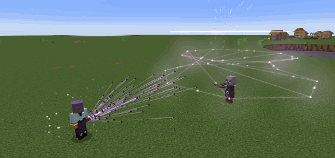
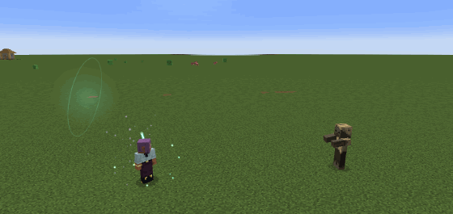
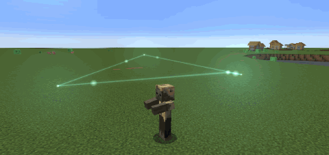
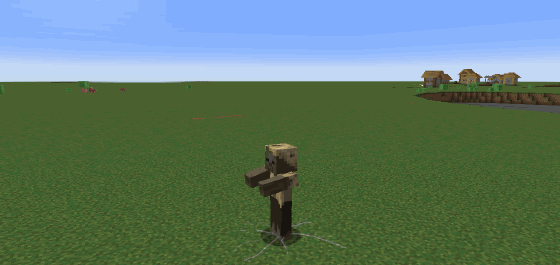
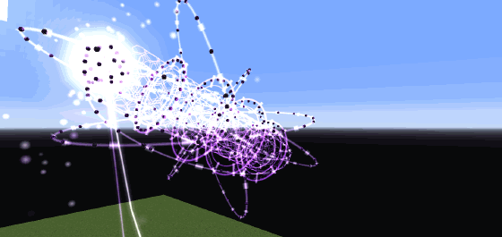
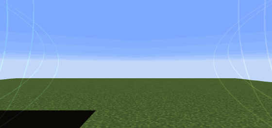
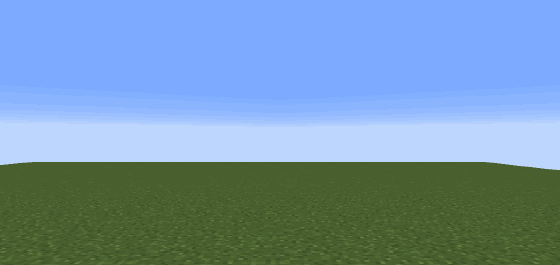
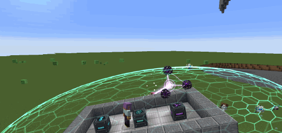

# EX-twins

Автономные щиты и боевые ульи-рои для Minecraft 1.21.1 (NeoForge, Curios). Уровни и улучшения встроены в мод, Relics не нужен. Эффекты сделаны на [Photon](https://github.com/Low-Drag-MC/Photon) и геометрией прямо в мире.



Все превью ниже сняты в игре сценариями мода (`runWorldScenarioClient`), это не монтаж.

| Капля | Обстрел | Сдерживание |
| --- | --- | --- |
|  |  |  |

| Армагеддон | Мана-Армагеддон | RF-Армагеддон |
| --- | --- | --- |
|  |  |  |



## Установка

Положите `EX-twins-1.0.0-beta.1.jar` и на клиент, и на сервер. Это бета: перед обновлением делайте копию мира.

Обязательно:

| Мод | Версия |
| --- | --- |
| NeoForge | 21.1.252 или новее (этого требует LDLib2) |
| Curios | 9.3.1 или новее (проверено на 9.5.1) |
| Photon | 2.2.7 или новее |
| LDLib2 | 2.2.41 или новее |
| KilaGraph | 21.1.0.15 |

По желанию:

- [LambDynamicLights](https://modrinth.com/mod/lambdynamiclights) 4.8.11+ (только клиент): щиты, удары роя, конструкции сдерживания и Армагеддоны освещают мир вокруг. Близкие источники сливаются, всего не больше 24, чтобы пересчёт света оставался дешёвым. Выключается клиентской настройкой `lights.dynamic`.
- [Create Aeronautics](https://modrinth.com/mod/create-aeronautics) (Sable): корабельные ульи ездят на кораблях и защищают их. Sable Companion уже внутри мода. Без Aeronautics ульи защищают место, где стоят.
- Botania, Ars Nouveau, Iron's Spells: источники маны для мана-батарей. Без них батареи заряжаются опытом игрока.

## Предметы

| Предмет | ID | Куда |
| --- | --- | --- |
| RF-щит, Mana-щит, Ex-Twins щит | `relics_addon:rf_shield`, `mana_shield`, `twins_shield` | слот Curios «Амулет» (`charm`) |
| RF-улей, Mana-улей, Улей Ex-Twins | `relics_addon:rf_hive`, `mana_hive`, `twins_hive` | слот `charm`, носить можно только один улей |
| Корабельные ульи «Копьё», «Эгида», «Эскорт» | `relics_addon:lance_hive`, `aegis_hive`, `escort_hive` | блоки, ставятся на корабль или на землю |

RF, Mana и Ex-Twins — это три семейства со своим видом, звуком и характером. Каждый предмет хранит свой опыт, уровень, очки и улучшения у себя в данных. Бой даёт опыт (с ограничением в минуту, `progression.maxExperiencePerMinute`), каждый новый уровень даёт очко улучшения. Уровней десять.

## Управление

- `H` — открыть консоль устройства. Удерживайте Shift, наведя курсор на устройство в любом инвентаре (и в окне Curios), — откроется его консоль. Любой щелчок отменяет удержание, так что Shift-щелчок по-прежнему переносит предмет.
- `G` — Армагеддон (у улья 10-го уровня с полной батареей).
- Использование устройства в руке включает и выключает его.
- Клавиши меняются в настройках управления.

Консоль — голографическое окно с вкладками **Обзор** (выключатель, уровень, целостность, заряд, главные характеристики), **Батареи**, **Улучшения** и у ульев **Рой**. Надписи сжимаются по ширине кнопки, а обрезанное видно целиком при наведении.

## Щиты

- **Прочность.** Общий запас 504 ОЗ, который улучшения защиты поднимают до 5000, плюс 420 отдельных ячеек по 12 ОЗ. Урон сначала тратит общий запас, потом ячейку в месте удара. Когда запас кончился, разбитые ячейки становятся настоящими дырами, и следующие удары через них проходят до ремонта. Всего на максимуме 10 040 ОЗ. Улучшение, переключение и настройки ОЗ не восполняют.
- **Вид.** RF и Ex-Twins — соты из тех самых 420 ячеек: плоские стёкла со светящимися швами и бликом по свету. Повреждённые RF-ячейки накаляются от жёлтого к красному, ячейки Ex-Twins тускнеют. Mana — цельный бирюзовый купол, повёрнутый к летящему снаряду. Щит невидим, пока по нему не ударят (`shield.idleOpacity` оставит его еле видимым).
- **Волна.** Удар по щиту Mana или Ex-Twins гонит по оболочке волну с гребнем и впадиной, а полоса преломления на её фронте искажает мир за щитом (`shield.refraction`, `shield.rippleStrength`, `shield.refractionStrength`; под шейдерпаками Iris/Oculus преломление выключается само). У Ex-Twins от точки удара по оболочке ещё растут фиолетовые дорожки печатной платы с бегущим по ним сигналом.
- **Ответный удар.** Агрессивного моба, коснувшегося оболочки, отбрасывает, и он получает урон щита: RF-разряд 3–7 (смягчается бронёй), Mana-вспышка 2,5–6 или удар Ex-Twins 4–9 (обе сквозь броню), от 0 до 10 уровня. Один моб — не чаще раза в секунду, удар стоит 6 очков батареи. Нейтральных мобов (эндермены, зомби-пиглины) щит бьёт только после того, как они нападут.
- **Радиус** от 2 до 12 блоков, открывается улучшениями. Выбор: `/relics_addon shield_radius <радиус>`. Сервер может ограничить потолок (`shield.maxRadius`).
- **Кого защищает:** `/relics_addon shield_coverage owner|allies|all` — только хозяина; хозяина, команду и прирученных; или всех живых внутри. По умолчанию — `allies`. Команды не требуют прав оператора и чужие предметы не трогают.
- **Снаряды.** Враждебные стрелы и снаряды, влетевшие в щит, перехватываются у самой оболочки; свои выстрелы проходят. Чужие пули из модов нужно добавить в тег `relics_addon:shield_interceptable_projectiles` или в `shield.interceptedProjectiles`; оружие мгновенного попадания (hitscan) требует адаптера. Трезубцы, жемчуг и зелья по умолчанию не останавливаются.
- **Взрывы и ближний бой** тратят общий запас, потом ячейки со стороны удара. Разрушение блоков и отбрасывание остаются ванильными.
- **Ремонт.** После 40 тихих тиков щит чинит повреждённые ячейки, потом общий запас.
- `/relics_addon shield_status` — диагностика надетых щитов (включён ли, активен ли слот, ОЗ). Ничего не меняет.

### Улучшения щитов

Покупаются во вкладке «Улучшения» за очки, по три ранга.

- **Распределение** — часть урона по ячейке уходит двум соседям: RF 25–45% с уровня 2, Mana 20–35% с уровня 3, Ex-Twins 35–50% с уровня 2.
- **Сбор** — целые ячейки переползают закрывать дыры: RF 1–2 с уровня 4, Mana 1–3 с уровня 2, у Ex-Twins нет. Путь 10 тиков, перезарядка 40. В пути ячейка не защищает, а на старом месте остаётся дыра.
- **Восстановление** — с уровней 5/4/3 (RF/Mana/Ex-Twins), ремонт 2/3/2 ОЗ за шаг.
- **Стабилизация** (только Ex-Twins, с уровня 4) — пауза перед ремонтом после удара 16 тиков вместо 40.

### Что пропускает щит

Списки в серверном конфиге, по умолчанию пустые. Элементы — id реестра или `#теги`; неверная запись пишется в лог предупреждением и ничего не совпадает.

- `shield.passingDamageTypes` — типы урона, которые всегда доходят до носителя, вдобавок к тегу `relics_addon:shield_passes` (голод, утопление, удушье, пустота). Например `["minecraft:fall", "#minecraft:is_fire"]`.
- `shield.absorbedDamageTypes` — типы урона, которые щит поглощает, хотя `shield_passes` их пропускает. `passingDamageTypes` сильнее.
- `shield.interceptedProjectiles` — что ещё сбивать в полёте, например `["minecraft:snowball"]`.
- `shield.ignoredProjectiles` — что никогда не сбивать в полёте (попадание по носителю всё равно поглощается).
- `shield.keptEffects` — вредные эффекты, которые щит не срезает, например `["minecraft:poison"]`.

## Батареи

У каждого устройства встроенные батареи: у RF — RF-батарея, у Mana — мана-батарея, у Ex-Twins — обе. Включённое устройство работает, пока в одной из его включённых батарей есть заряд; иначе на мониторе консоли «НЕТ ПИТАНИЯ». Новые устройства заряжены полностью, ёмкость растёт с уровнем: 25 000–100 000 очков (очко = 10 FE).

- **Расход:** работающий щит 20 очков в секунду, улей 20 плюс одно на каждые 10 дронов. Поглощённый урон 10 за ОЗ, ремонт щита 2 за ОЗ, выстрел дрона 3, лечение 5 за ОЗ, ремонт дрона 1 за ОЗ. Ex-Twins делит каждый расход между двумя батареями. В творческом режиме бесплатно.
- **RF-батарея** — предмет Forge Energy: её заряжает любое FE-зарядное устройство (Mekanism, Thermal, Flux Networks…), а заряженный FE-предмет в слоте зарядки консоли переливает энергию в неё. Машины её не опустошают.
- **Мана-батарея** заряжается дважды в секунду, пока устройство включено. Источник выбирается в консоли: «Авто» (сначала магия, потом опыт), «Магия» (предметы маны Botania, мана игрока Ars Nouveau или Iron's Spells, с запасом 25% на заклинания) или «Опыт».
- У каждой батареи свой выключатель во вкладке «Батареи».
- Все ставки — серверный конфиг `power.*`; `power.requireBatteries = false` делает устройства бесплатными.

## Ульи

Наденьте улей в слот амулета и включите. Носить можно только один (Curios не даст второй). У RF-улья четыре серебряные створки, у Mana — шесть створок слоновой кости с золотом, у Ex-Twins — двенадцать чёрных пятиугольных пластин с фиолетовой инкрустацией.

| Семейство | Дронов, уровень 0 → 10 | В воздухе | ОЗ дрона | Ремонт → с улучшением | Урон удара → с улучшением |
| --- | --- | --- | --- | --- | --- |
| RF | 100 → 2000 | до 250 | 3 | 4 → 2 с | 2 → 3 |
| Mana | 100 → 2000 | до 250 | 3 | 2,5 → 1 с | 2 → 3 |
| Ex-Twins | 100 → 2000 | до 250 | 3 | 6 → 3 с | 3 → 4 |

### Три режима

Дроны делятся между режимами во вкладке «Рой», и режимы сражаются одновременно, каждый своими дронами.

- **Капля.** Дроны встают углами фигур (от одной до шестнадцати), веером за спиной хозяина, и фигуры по очереди бьют цель целиком, отбрасывая её.
  - RF — таран-тессеракт: вращается через четвёртое измерение, на замахе схлопывается в куб, с лязгом врезается в цель и разлетается веером дронов.
  - Mana — дождь капель: гранёные стеклянные капли взмывают над целью и падают на неё одна за другой, разбиваясь в брызги и круги по земле.
  - Ex-Twins — прыжок через разлом: фигура из шестиугольников с молниями между ними ныряет в разрыв пространства у хозяина и вырывается из другого у цели.
- **Обстрел.** Дроны собираются вокруг цели в светящиеся сгустки примерно по шестнадцать, и сгустки одной цели рисуют узор семейства: корона RF, звезда Mana, восьмиугольники Ex-Twins. В каждом сгустке копится выстрел; он проходит сквозь стены и взрывается на цели, искажая пространство.
  - RF стреляет кольцом молнии, которое рассыпается разрядами во все стороны.
  - Mana — светящимися шарами.
  - Ex-Twins — фиолетовым стеклянным икосаэдром, который разбивается на осколки.
- **Сдерживание.** Каждая конструкция держит одно существо и оглушает его. Игроков и боссов держать нельзя.
  - RF запирает цель в клетку Фарадея: геодезическую сферу, которая смыкается снизу вверх, как лепестки, бьёт пленника током и уводит его выстрелы в землю молнией.
  - Mana закрывает цель лотосом из стеклянных лепестков; удар по лотосу возвращается в атакующего золотыми искрами.
  - Ex-Twins раскалывает пространство вокруг цели: шестиугольные осколки с пустотой и звёздами за ними кружат вокруг, а цель висит в трещине.

Каждый удар — замах, полёт и попадание: прицельный круг на земле, следы дронов, раскалённое ядро, ударное кольцо, искры, выжженный след. Звуки синтезированы для мода и идут слоями (замах, шум летящей фигуры, удар, отзвук); удары разных групп роя звучат ступенями пентатоники. Сколько эффектов рисовать и как сильно трясти камеру — клиентские `hive.effects` (`low`, `normal`, `high`) и `hive.shake`.

### Цели и бой

- Рой сражается в пределах 128 блоков от хозяина (`hive.targetRange`, `hive.pursuitRange`). Он берётся за всех, кто нападает на хозяина: кого хозяин бьёт, кто бьёт хозяина или его щит и каждого моба, нацеленного на хозяина, — до 16 сразу.
- Когда цель падает, дроны летят к следующей прямо оттуда, где были.
- У дрона 3 ОЗ. Подбитый дрон летит домой на ремонт, а его место сразу занимает следующий.
- Дроны не трогают хозяина, его команду и питомцев, игроков в творческом режиме и тех, по кому PvP запрещён. Убийство засчитывается хозяину.
- Лекари кружат у груди хозяина и лечат только его, не больше 4 ОЗ в секунду (`hive.maxHealingPerSecond`).
- Дроны не принимают урон за хозяина — это работа щита.
- На сервере нет сущностей-дронов и поиска пути: предмет хранит компактный массив дронов, а полёт детерминирован и одинаково считается на сервере и клиенте, поэтому удары приходятся ровно туда, где нарисованы фигуры.
- У каждого улья три улучшения: урон, сила лечения и ремонт дронов.

### Распределение дронов

Во вкладке «Рой» есть строка для каждого режима и для лекарей: сколько дронов, минимум, сколько из них в воздухе, ползунок. Сверху — свободные дроны.


- **Минимум.** Дроны стоят в углах фигуры, поэтому режим либо выключен, либо получает хотя бы одну фигуру:

  | Семейство | Капля | Обстрел | Сдерживание |
  | --- | --- | --- | --- |
  | RF | 16 (углы тессеракта) | 4 (корона) | 12 (икосаэдр клетки) |
  | Mana | 14 (капля) | 6 (звезда) | 19 (лотос) |
  | Ex-Twins | 18 (три шестиугольника) | 8 (восьмиугольник) | 24 (четыре осколка разлома) |

- **Ползунки** останавливаются только на целых фигурах. Режим, на фигуру которого свободных дронов не хватает, серый, а подсказка объясняет почему. **Все** отдаёт всех бойцов одному режиму. Сервер проверяет те же правила и отклоняет всё остальное.

  

- **В воздухе** не больше 250 дронов. Сначала места получают лекари, остальное режимы делят пропорционально. Режиму, чья доля меньше минимума, места нет — строка заранее пишет «в воздухе 0: нет места».

  

- **Потери.** Когда у режима не осталось запасных и в воздухе меньше одной фигуры, он улетает домой, а после ремонта возвращается в бой сам.

## Армагеддоны

Ульта улья 10-го уровня. Когда батарея улья заполнена (98% и больше), `G` открывает окно подтверждения: расстояние, радиус, время заряда и что добавит надетый щит своего семейства. Цель — точка, куда вы смотрите, до 256 блоков. Заряд длится минуту и опустошает батарею; надетый щит того же семейства подпитывает его, но не отдаёт заряд, нужный его собственному полю.

Урон — 2000 в центре и до 20 на краю. Армагеддон бьёт мобов и игроков, не союзных хозяину, если на сервере включено PvP; хозяина, его команду и питомцев не трогает. С `armageddon.safeMode` блоки не ломаются и кратеры не роются.

- **Армагеддон (Ex-Twins).** Рой собирается над головой в пушку из гексагонального ствола, колец и гироскопа. Выстрел — шар белого света в трёх фиолетовых торах из дронов. У цели он раскрывается чёрной дырой в 15 блоков, которая вырывает блоки в радиусе 90 и затягивает существ, сжимается, пульсируя, и взрывается сверхновой: вспышка, волна светящейся дымки до 256 блоков, столб энергии в зенит шириной до 128 блоков и оранжевые сумерки. Около 30 секунд.
- **Мана-Армагеддон.** Над плечами раскрываются два цветка — бирюзовый и золотой — с печатями и кольцами рун, которые пишутся по одной. Цветки выпускают два потока, сходящиеся на цели, и земля в 90 блоках закручивается вихрем камней. Там, где потоки встретились, загорается маленькое солнце в сфере рун; сфера трескается, и купол света проходит до 256 блоков, а со дна печати растёт столб света в 96 блоков шириной. Около 40 секунд.
- **RF-Армагеддон.** Рой строит голограмму дрона-ретранслятора в 13 блоков; её четыре панели раскрываются по мере заряда. Перед носом растёт шар с тёмным ядром, молниями и орбитами электронов. Шар медленно летит, бьёт молниями во всё в 48 блоках, зависает перед поверхностью, в которую целились, и мир сереет. Затем он становится куполом ледяного стекла в 88 блоков, атомная вспышка обращает мир в чёрные силуэты на белом, ударный фронт уходит на 256 блоков, остаётся круглый кратер с вывороченным краем. Около 40 секунд.

Всё нарисовано в мире, а не поверх экрана. Под шейдерпаками Iris/Oculus рисуются упрощённые замены.

## Корабельные ульи

Три блока для корабля [Create Aeronautics](https://modrinth.com/mod/create-aeronautics) или базы на земле. Их дроны размером примерно с блок сражаются сами.

| Блок | Дронов | Что делают |
| --- | --- | --- |
| «Копьё» (дроны Ex-Twins) | 3, одной турелью | Непрерывный луч по самой опасной цели в поле зрения: 3 урона четыре раза в секунду, 100 FE за тик. Через 8 секунд перегревается и остывает 4 секунды. Если на линии огня кто-то другой, не стреляет. |
| «Эгида» (дроны Mana) | 6, каждый держит свой кусок | Щит вокруг всего корабля — эллипсоид по корпусу (на земле купол в 8 блоков). Останавливает стрелы, огненные шары и снаряды Create Big Cannons, принимает удары, предназначенные экипажу, и гасит взрывы снаружи. Полный щит держит 400 (снаряд большой пушки стоит 40). Восстанавливается от FE через 3 секунды без попаданий; слишком сильный удар ломает щит на 5 секунд. 30 FE за тик. |
| «Эскорт» (дроны RF) | 4, двумя крыльями | Два крыла, каждое — связанная пара со своим маленьким роем. Патрулируют вокруг корабля, догоняют угрозы в пределах 40 блоков, бьют дугой между двумя дронами и пикированием роя, возвращаются подзарядиться. |

- Ставьте улей снаружи корпуса: дроны вылетают со светящейся грани. Правый щелчок открывает окно улья, Shift + правый щелчок включает и выключает его сразу. Сигнал редстоуна сажает дронов. Энергия — FE по любому кабелю с любой стороны, батарея на 400 kFE.
- Ульи одного корабля думают вместе: общая доска угроз (обновляется дважды в секунду) и полминуты обиды на тех, кто ранил экипаж или корпус. Хозяева, их команды и питомцы под огонь не попадают; другие игроки — только после того, как ранят экипаж или корабль, при включённом PvP (или всегда, с `ship.targetPlayers`).
- Ульи следят за настоящим положением корабля Sable, так что турель, щит и крылья едут с кораблём, как бы он ни поворачивал.
- Настройки сервера: `ship.targetRange`, `ship.targetPlayers`, `ship.lanceDamage`, `ship.lanceEnergyPerTick`, `ship.aegisUpkeep`, `ship.aegisEnergyPerPoint`, `ship.escortLeash`, `ship.escortDamage`.

## Крафт

Устройства собираются из собственных деталей мода, а детали — из ванильных материалов, так что крафт работает в любой сборке. Рецепты открываются в книге рецептов, когда у вас есть ключевая деталь.

| Деталь | Из чего | Куда идёт |
| --- | --- | --- |
| Резонансная схема (×2) | золотые самородки, редстоун, кварц, медный слиток | во все детали и устройства |
| Энергоячейка | медь, железо, блок редстоуна, схема | RF- и Ex-Twins-устройства |
| Мана-ячейка | осколки аметиста, золото, блок лазурита, схема | Mana- и Ex-Twins-устройства |
| Ядро щита RF / Mana / Ex-Twins | ванильный щит и железо с алмазом / золото, блок аметиста и алмаз / плачущий обсидиан, эхо-осколки и алмаз, плюс схемы | свой щит |
| Каркас RF-дрона (×2) | железо, медь, редстоун, схема | RF-улей (шесть каркасов) |
| Оболочка мана-дрона (×2) | золотые самородки, осколки аметиста, схема | Mana-улей (шесть оболочек) |
| Пластина дрона Ex-Twins (×2) | обсидиан, осколки аметиста, схема | Улей Ex-Twins (четыре пластины, обе ячейки и кристалл Края) |
| «Копьё» | три пластины Ex-Twins, схема, энергоячейка, четыре железных блока | корабль |
| «Эгида» | шесть оболочек мана-дронов, ядро Mana-щита, две схемы | корабль |
| «Эскорт» | четыре каркаса RF-дронов, схема, энергоячейка, три железных блока | корабль |

## Настройки

**Сервер** (`config/relics_addon-server.toml` в мире):

| Ключ | Что задаёт |
| --- | --- |
| `shield.maxRadius` | потолок радиуса щита |
| `shield.strikeDamage`, `shield.strikeKnockback`, `shield.strikeCooldownTicks` | ответный удар щита |
| `shield.passingDamageTypes`, `shield.absorbedDamageTypes`, `shield.interceptedProjectiles`, `shield.ignoredProjectiles`, `shield.keptEffects` | что пропускает щит (см. выше) |
| `hive.targetRange`, `hive.pursuitRange` | дальность боя роя |
| `hive.strikeEfficiency`, `hive.maxHealingPerSecond` | сила ударов и лечения |
| `power.requireBatteries`, `power.experiencePointValue`, `power.experienceReserveLevels`, `power.playerManaValue`, `power.playerManaReserve`, `power.botaniaManaPerPoint` | батареи и источники маны |
| `armageddon.safeMode` | Армагеддоны не ломают блоки |
| `progression.maxExperiencePerMinute` | предел опыта в минуту |
| `ship.*` | корабельные ульи |

**Клиент:** `shield.refraction`, `shield.rippleStrength`, `shield.refractionStrength`, `shield.idleOpacity`, `lights.dynamic`, `hive.effects`, `hive.shake`.

**Команды** (без прав оператора): `/relics_addon shield_radius <r>`, `/relics_addon shield_coverage owner|allies|all`, `/relics_addon shield_status`.

## Совместимость

- **Шейдерпаки (Iris/Oculus):** преломление щита выключается, Армагеддоны рисуют упрощённые замены, RF-Армагеддон не обесцвечивает мир.
- **Sable / Veil:** Veil переписывает шейдеры ядра; шейдеры мода написаны так, чтобы его GLSL-обработчик их не ломал.
- **Create Big Cannons:** «Эгида» останавливает снаряды больших пушек и автопушек.
- **Энергия:** RF-батареи и корабельные ульи принимают FE от любых модов.

## Для разработчиков

Нужны Java 21 и встроенный Gradle wrapper. Зависимости берутся из Maven (`maven.theillusivec4.top`, `maven.firstdark.dev/snapshots`, `maven.gegy.dev`), в `libs/` ничего класть не нужно.

```bash
./gradlew build              # сборка, проверки verify* и проверка содержимого релизного jar
./gradlew runGameTestServer  # GameTest'ы в отдельном мире run-gametest
./gradlew runClient          # клиент для разработки
```

Результат — `build/libs/EX-twins-1.0.0-beta.1.jar`. `runReleaseCheckClient` проверяет упакованный релиз из `run-release-check/mods`. Тесты, сценарии съёмки и галерея моделей в релизный jar не попадают.

**Съёмка.** `./gradlew runWorldScenarioClient -Pscenario=juice-rf-droplet,armageddon-close` снимает сцены в живом мире в `run-scenario/screenshots`: кадры `scenario-<сцена>-NNN.png`, игровое время кадров `.ticks` и журнал звуков `.sounds` (каждый звук с громкостью, высотой, местом и положением камеры, а звуки, следующие за источником, — каждый тик). `runShipScenarioClient` снимает корабельные ульи на настоящем корабле Sable (сначала положите jar Sable в `run-ship/mods`).

Инструменты в `tools/` (Node.js, сначала `cd tools && npm install`):

- `mix_scenario_audio.mjs --take <сцена> … --out film.wav --frames dir` — сводит звуковую дорожку снятых сцен по их журналам (линейное затухание Minecraft с расстоянием, панорама по взгляду камеры) и раскладывает кадры на одну шкалу для видео.
- `build_showcase_gif.mjs --out файл.gif --width 560 --segment "кадры-*.png:шаг:задержка_мс"` — GIF-превью из кадров, как в этом README.
- `build_combat_sounds.mjs` — синтезированные звуки (`--validate` проверяет их).
- `build_mana_shield_mesh.mjs`, `draw_component_icons.mjs`, `draw_rune_atlas.mjs`, `compact_obj.mjs` — модели, иконки, руны и сжатие OBJ (`./gradlew check` ловит несжатую модель).

## Ограничения беты

- Это не гарантия совместимости с любой сборкой, мультиплеером или шейдерпаком.
- Снаряды других модов нужно добавлять тегом или конфигом, hitscan-оружию нужен адаптер; трезубцы и бросаемые предметы не перехватываются.
- Предметы дронов из ранних прототипов не восстанавливаются.
- Подписи-подсказки сдерживания в переводах ещё описывают старый вид конструкций.

## Лицензия

All Rights Reserved, как указано в метаданных мода. У зависимостей свои лицензии.
