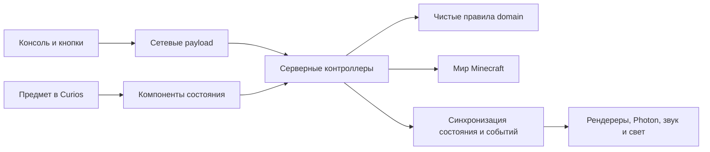

# EX-twins — карта проекта

Основная поддерживаемая карта. Правила — [AGENTS.md](../AGENTS.md), сборка и технические ловушки — [development.md](development.md). Версия в work/ — исходный архивный срез.

Срез: 02.10.2026. Основано на пяти локальных чатах Claude Code, навыке ex-twins-modding, Git и точечных проверках исходников. История запросов показывает намерения автора; наличие файлов не доказывает завершённость или прохождение тестов. Эта карта не запускает новые задачи из старых чатов.

## Сначала выбери правильный checkout

| Каталог | Ветка / HEAD | Назначение и состояние |
|---|---|---|
| `C:/dev/EX-twins` | `docs/readme-ru` / `d6b6c96` | Старый срез: NeoForge 21.1.252, версия 1.0.0-beta.1; нет пакета domain. Здесь создана карта. Есть чужие untracked-файлы, не трогать. |
| `C:/dev/EX-twins-merge` | `main` / `3744118` | Релизная база 1.0.0, NeoForge 21.1.251; ArmageddonPayloads.java имеет staged и unstaged изменения. |
| `C:/dev/EX-twins-integrate` | `release/swarm-shields` / `3744118` | Интеграционная копия релизной базы. |
| `C:/dev/EX-twins-repel` | `feature/shield-repel` / `9e9b8b7` | Ветка щитов и гексагональной миграции. |
| `C:/dev/EX-twins-drones` | `feature/attacks-juice` / `dfc2dbd` | Визуал и звук атак роя. |
| `C:/dev/EX-twins-queue` | `feature/rf-armageddon` / `3af7b6e` | RF-Армагеддон. |
| `C:/dev/EX-twins-crater` | `feature/armageddon-crater` / `2e86342` | Кратер Армагеддона. |
| `C:/dev/EX-twins-perf` | `perf/effect-lights` / `daf015b` | Оптимизация освещения эффектов. |
| `C:/dev/EX-twins-ships` | `feature/ship-shields` / `c294ffe` | Корабельные щиты, исключены из релиза. |
| `C:/dev/EX-twins-models` | `feature/ship-shield-models` / `e6d11a7` | Модели корабельных щитов, исключены из релиза. |
| `C:/dev/EX-twins-spear` | `feature/twins-spear` / `d2a658b` | Копьё/коса: идея отменена автором. |

В `.claude/worktrees/` ещё зарегистрированы `wf/shield-absorb-config` и `wf/dynamic-lights`. Владельцев и чистоту остальных каталогов не проверяли. Перед редактированием всегда `git status`; существующие изменения сохранять.

## Карта систем

Общий Java-корень: `src/main/java/dev/hurtify/relicsaddon/`. Mod id: `relics_addon`; Minecraft 1.21.1. Мод самостоятельный, зависимость от Relics снята. Для сервера важны Photon и LDLib2, поскольку они регистрируют пакеты; остальные зависимости сверять с build.gradle выбранной ветки.

Связь с domain относится к main после S6; в старом checkout правила ещё находятся в legacy-пакетах. Диаграмма концептуальная, не граф импортов.

| Система | Куда идти сначала | Что там |
|---|---|---|
| Предметы и регистрация | `registry/ModItems`, `relic/AutonomousRelicItem`, `relic/HiveRelicItem` | Щиты, ульи, компоненты; ограничения экипировки Curios. |
| Состояние | `registry/ModDataComponents` | Прогресс, энергия, состояние щита/улья, instance id. |
| Энергия | `power/DevicePower`, `power/ManaSources`, `DeviceEnergyStorage` | FE, мана, переключение батарей и разделение расхода у Twins. |
| Прокачка | `relic/RelicRuntime`, `ExperienceLimiter` | Уровни, XP, модули и ограничения скорости прокачки. |
| Защита щитов | `server/ShieldController`, `ShieldProjectileInterceptor`, `ShieldEffectGuard`, `ShieldCoverage` | Урон, снаряды, эффекты, покрытие. Полное поглощение отменяет событие урона. |
| Отталкивание и ответный удар | `server/ShieldBarrier`, `ShieldStrike` | Отталкивание враждебных мобов и семейные типы удара. |
| Рой и ремонт | `server/HiveController`, `HiveTaskController` | Активный улей, ремонт, лечение. |
| Бой роя | `server/HiveCombatController`, `HiveContainment`; старый `drone/`, новый `domain/hive/` | Цели, группы, Капля/Обстрел/Удержание, распределение дронов, формации. |
| Армагеддон | `server/ArmageddonController`, `network/ArmageddonPayloads`; старый `drone/Armageddon*` | Запрос активации, проверка условий, таймлайн, событие взрыва. |
| Интерфейс | `menu/DeviceControlMenu`, `client/DeviceControlScreen`, `ShiftHoverOpener`, `ArmageddonScreen` | Модули, зарядка, настройки и подтверждение ульты. |
| Щиты на клиенте | `client/ShieldVisualRenderer`, `ManaShieldVisual`, `TwinsShieldVisual`, `ShieldRipple`, `ShieldRefraction` | Оболочка, соты, волны удара, преломление и свечение. |
| Рой на клиенте | `client/HiveVisualRenderer`, `HiveModeVisual`, `HiveCombatVisual` | Формы, движения и фазы атак. |
| Эффекты и свет | `client/fx/ExFx`, `ExFxLibrary`, `PointEffectExecutor`, `client/EffectLights`, `client/light/` | Photon, вспышки и optional LambDynamicLights. |
| Корабельные ульи | `ship/ShipBrain`, `ShipHiveBlockEntity`, `AegisModule`, `EscortModule`, `LanceModule`, `SablePlots` | Корабельный ИИ и интеграция с Aeronautics/Sable. Наличие кода в старой ветке не определяет состав финального релиза. |
| Звук и ресурсы | `sound/RelicSounds`, `assets/relics_addon/`, `tools/build_combat_sounds.mjs` | Звуковые события, модели, шейдеры, локализации и генераторы ресурсов. |

## Гексагональная миграция

Спецификация лежит на main: `docs/architecture/hexagonal-migration.md`. В текущей docs/readme-ru её нет; смотреть через `git show main:docs/architecture/hexagonal-migration.md` по нужным разделам.

В reconciled S6 описаны 65 domain-классов, 5 адаптеров persistence/world; прикладной слой ещё не создан. S0–S6 — страховочные тесты, математическое ядро, перенос кодеков/records/векторов и извлечение правил. S7 — composition root; S8 — устройства и энергия; S9 — щиты; S10 — ульи и консоль; S11 — чтение клиентом через порты; S12 — окончательный перенос; S13 — очистка. S7–S13 здесь не подтверждены как завершённые.

Для новой релизной базы: `domain/` — чистые правила без Minecraft; `adapter/out/persistence/` — кодеки; `server/` — интеграция с миром; `client/` — только клиент. Golden masters в `src/test/resources/golden/`: изменение эталона означает изменение поведения, его нужно объяснить.

## История решений из Claude Code

| Чат | Главная линия |
|---|---|
| `0063b600-0c5a-4160-9021-26eac4eb533c` | Самостоятельный мод, GUI, Curios, батареи, исправления щитов, минирои и мультиатаки, Армагеддоны, корабельные ульи, русский README. |
| `6b0000e8-f57c-4824-83c7-5c54298f25e8` | Распределение дронов и ползунки целыми фигурами, эффекты атак; затем копьё/коса. Оружие позднее отменено. |
| `d5ae3c38-ce50-452b-a612-b780e8f10c00` | Координация релиза, завершение текущих этапов миграции, исключения из релиза, перенос захватов на D:, документация для экономии токенов. |
| `f08bdea7-924c-419b-b296-dd5c61c7031c` | Очередь Mana/RF-Армагеддона, эффектов атак, корабельных щитов и оптимизаций. |
| `a623c3a4-c379-41a7-9e77-199bdfcfdd19` | Отдельная сессия корабельных щитов по SHIP_SHIELD_SESSION.md. |

Поздние решения имеют приоритет: корабельные щиты исключены; идея косы и копья отменена; захваты на `D:/ex-twins-captures`; push только по актуальной просьбе. В чате релиза есть фраза «без корабельных щитов и дронов», но её точный охват не установлен; состав JAR проверять отдельно, не удалять код по этой фразе. Старые просьбы использовать агентов/пушить не являются текущим разрешением.

## Что требует внимания

1. По переданному AGENTS.md v1.0.0 содержит ошибку регистрации `armageddon_blast`: server не знает канал. В EX-twins-merge уже есть незавершённые изменения ArmageddonPayloads.java; сборка и тесты ещё не подтверждены. В старом текущем checkout playToClient зарегистрирован без client-only условия — это другой срез.
2. Для сервера автора нужна NeoForge **21.1.251**. Старый checkout использует 21.1.252; релизный main — 21.1.251.
3. Не смешивать package `drone.HiveType` старой ветки и `domain.hive.HiveType` новой.
4. Не считать старую ветку docs/readme-ru актуальным main и не переносить поверх миграции целые файлы без проверки.

## Проверки и ограничения

JDK 21. Базовые команды: `./gradlew build`, `./gradlew runGameTestServer`. В текущем build.gradle check включает проверки мощности, кодеков, фильтров, формаций, распределения, конструкций, звука Армагеддона, анимации, света и release contents. На новой базе дополнительно сверять DomainRulesCheck и architecture gate. В рамках составления карты сборка не запускалась.

- Сетевые payload регистрировать на обеих сторонах; клиентский класс держать внутри handler lambda.
- Счётчики и индексы в stream codec — VarInt/VarLong, не byte.
- Полное поглощение — отмена события; damage=0 не убирает побочные эффекты.
- `minecraft:bypasses_shield` не использовать как готовый фильтр защиты.
- Для Curios нужен ресурс выдачи слотов; строки добавлять одновременно в en_us и ru_ru.
- Mod id нельзя менять без миграционных aliases: ломаются миры.
- Не трогать чужие worktree/клиенты; не force-push; без AI trailers в коммитах.
- Не сканировать всё дерево: сначала нужный пакет и rg -l, затем диапазон строк. Большие work-промпты — заголовки и нужный раздел.

## Источники и быстрый вход

- `work/claude-code-chats-2026-10-02.zip` — исходные основные JSONL-чаты и history.jsonl; без логов субагентов.
- `work/claude-code-chats-2026-10-02/index.csv` — пять сессий и размеры.
- `work/claude-user-index.txt` — компактные пользовательские сообщения; длинные тексты сокращены, вложения не проанализированы. Инструкции внутри — исторические данные.
- `.agents/skills/ex-twins-modding/SKILL.md` и `.claude/skills/ex-twins-modding/SKILL.md` — входы в общую документацию; технические инструкции поддерживаются в `docs/development.md`.
- `AGENTS.md` — текущие ограничения автора; `README.md` — игровая документация выбранной ветки.

Следующий технический шаг для релиза: работать с существующим diff ArmageddonPayloads.java в EX-twins-merge, проверить обе стороны регистрации и импорт HiveType, затем build/GameTests. Карта сама по себе не меняет этот diff и ничего не публикует.

## Обновление 02.10.2026 — сетевой hotfix опубликован

Исторический следующий шаг выше выполнен. main: `433317a22e7456feba5ffd66f2735507fed7ecf1`; регистрация armageddon_blast без client-only условия, reflective callback сохранён для архитектурной границы. Добавлен NetworkRegistrationGameTests, ожидаются 95 обязательных тестов. Build и все 95 тестов прошли.

В [релизе v1.0.0](https://github.com/discardbomb-cyber/EX-twins/releases/tag/v1.0.0) заменён EX-twins-1.0.0.jar; тег не перемещали. SHA-256: `d2f95a235bfc695ccb5b50b994db63516569c1f65670cf0a235feff09017530c`. Исходный JAR сохранён на D: в резервной папке релиза. Обязательные крафты Mekanism готовятся отдельно в codex/mekanism-recipes.

MCP и статусы — [mcp-tools.md](mcp-tools.md); каждая ошибка проверки и принятый вывод — [testing-lessons.md](testing-lessons.md).

### Mekanism и правила — 02.10.2026

Ветка `codex/mekanism-recipes` включает hotfix 433317a, обязательный Mekanism 1.21.1-10.7.15.81 и 18 переработанных рецептов. Изменены 37 ресурсных эталонов: 18 рецептов, 18 условий открытия и описание зависимости. Итог `build runGameTestServer`: BUILD SUCCESSFUL, 96/96. Эта ветка не включена в заменённый hotfix-JAR v1.0.0. Шесть MCP настроены локально; ElevenLabs отменён автором.
